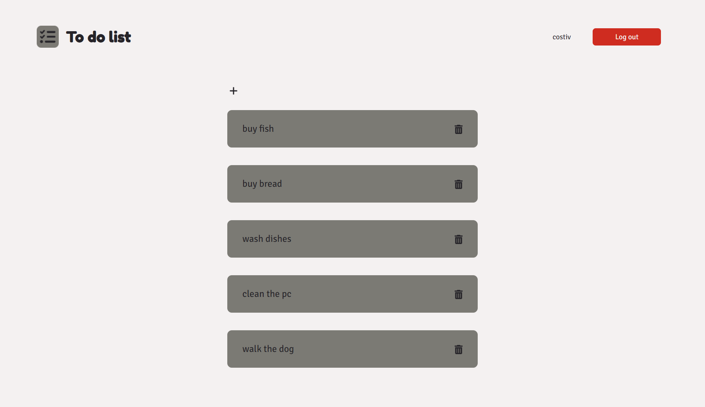
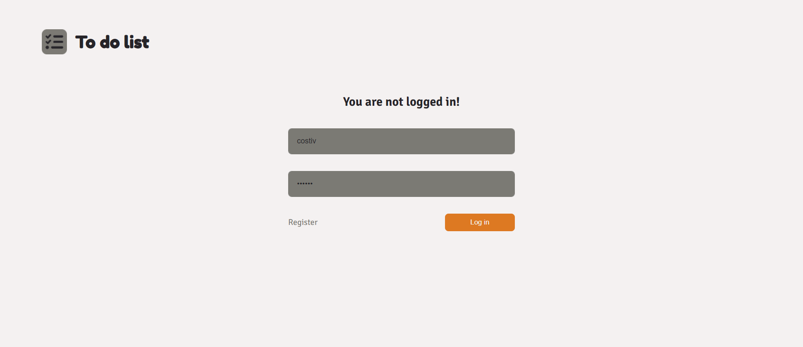
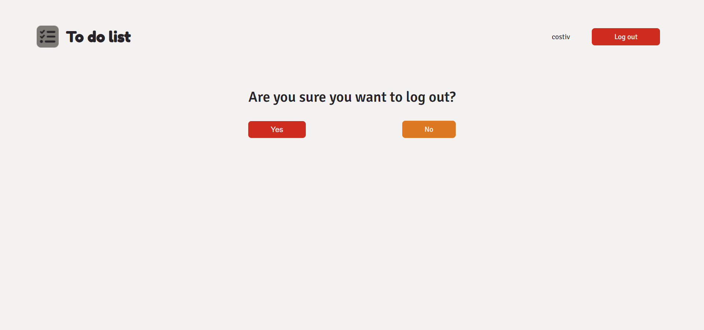
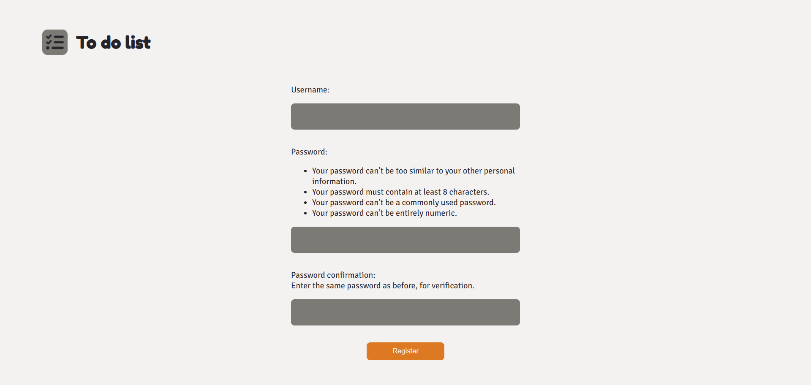
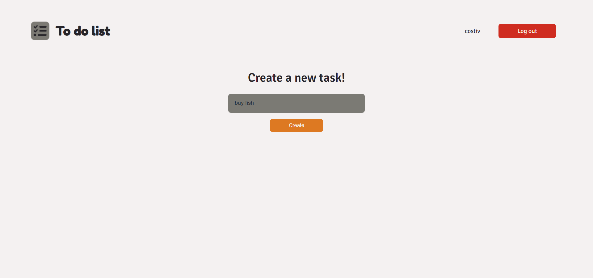
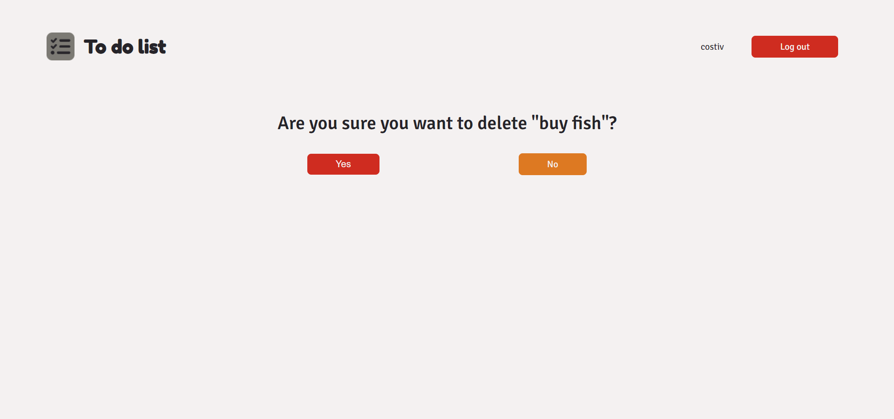

# To-Do-list-app

## Table of Content:

- [About The App](#about-the-app)
- [Screenshots](#screenshots)
- [Technologies](#technologies)

## About The App
This is a To-Do list app where you can create an account and write your own tasks. You can create multiple accounts.

## Screenshots
### Home page

### Log in page

### Log out page

### Register page

### Create task page

### Delete task page

## Technologies
I used `html`, `scss` and  `Django`.
